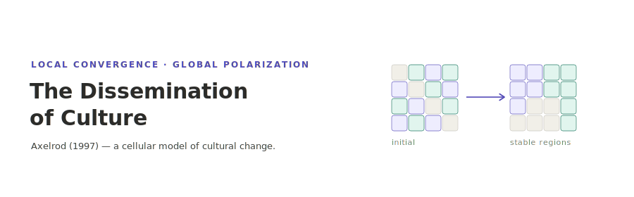

<p align="center"></p>

[English](README.md) | **日本語**

# 文化の拡散 — Axelrod (1997)

Axelrod (1997) "The Dissemination of Culture: A Model with Local Convergence and Global Polarization" の文化拡散モデルを再現実装したプロジェクトです．2次元格子上の各サイトは文化ベクトルを持ち，類似した隣人を模倣します．穏やかな局所相互作用が文化地域への局所収斂を生む一方で，全体のパターンは分極化したまま残りえます．シミュレーションは socsim フレームワーク上の Rust，可視化ツールは Python で実装しています．

## インストールとクイックスタート

```bash
# Rust シミュレーションのビルド
cargo build --release

# 統合テストの実行
cargo test --release

# 単一パラメータでの実行 (Table 7-2 ベースケース: f=5, q=10, 10×10, 10回)
cargo run --release -- simulate --features 5 --traits 10 --runs 10 --seed 42

# Python 可視化ツールのインストール
uv sync

# 最新の実行結果を可視化 (results/latest を自動参照)
uv run python analysis/visualize.py
```

## ドキュメント

- [ユースケース](docs/usecases.ja.md) — 本プロジェクトでできること．各ドキュメントへの入口．
- [CLI](docs/cli.ja.md) — Rust CLI：`simulate` と `sweep` サブコマンド，`results/` 出力レイアウト．
- [論文再現](docs/reproduction.ja.md) — Table 7-2 ベンチマークと f×q の非対称性，再現方法．
- [可視化](docs/visualization.ja.md) — Python `analysis/visualize.py` と出力の解釈．
- [アーキテクチャ](docs/architecture.ja.md) — リポジトリ構成，socsim フレームワーク，参照論文，設計判断．

## ライセンス

MIT
